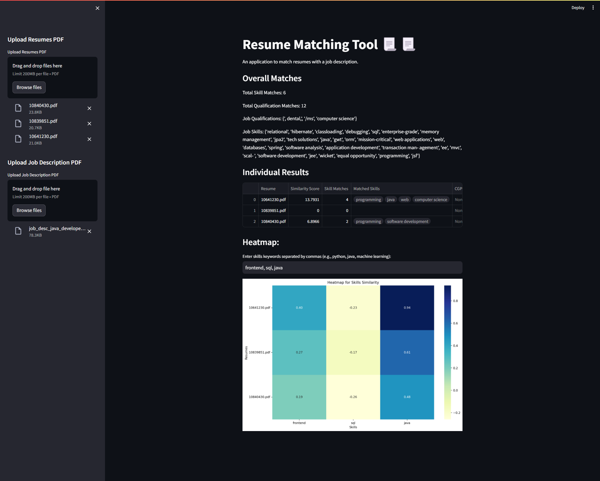

# Resume Matching Tool 📃📃

An application to match resumes with a job description.



## Introduction

This application is designed to help recruiters and hiring managers efficiently match resumes with a job description. It uses natural language processing (NLP) techniques to analyze the content of resumes and job descriptions, and then provides a similarity score based on the match between the two.


## Features

- Upload multiple resumes and a job description in PDF format.
- Extract text from PDF files using PyPDF2.
- Tokenize text using the spaCy NLP model.
- Extract CGPA, skills, and qualifications from resumes using a finetuned BERT model.
- Display overall matches and individual results in a table.
- Download the results as a CSV file
- Generate a heatmap to visualize the similarity between skills keywords and resumes.

## Installation

1. Clone the repository:

```bash
git clone https://github.com/parthkulkarni04/Resume-Matching-Codewits.git
```
2. Navigate to the project directory:
```bash
cd Resume-Matching-Codewits
```
3. Create a virtual environment:
```bash
python3 -m venv venv
```

4. Activate the virtual environment:

On macOS/Linux:
```bash
source venv/bin/activate
```
On Windows:

```bash
venv\Scripts\activate
```

5. Install the required Python packages:

```bash
pip install -r requirements.txt
```

## Usage

1. Upload resumes and a job description in PDF format.
2. View the overall matches and individual results in a table.
3. Generate a heatmap to visualize the similarity between skills keywords and resumes.
4. Download the results as a CSV file

## Run the Streamlit BERT Version 

```bash
streamlit run bert.py
```

## Run the Streamlit Doc2Vec Version 

There is also an older version of the application available in the repository. This version only uses Doc2Vec instead of BERT for extraction, which makes it faster but not as accurate as the current version. You can run that using the following command.

```bash
streamlit run doc2vec.py
```
